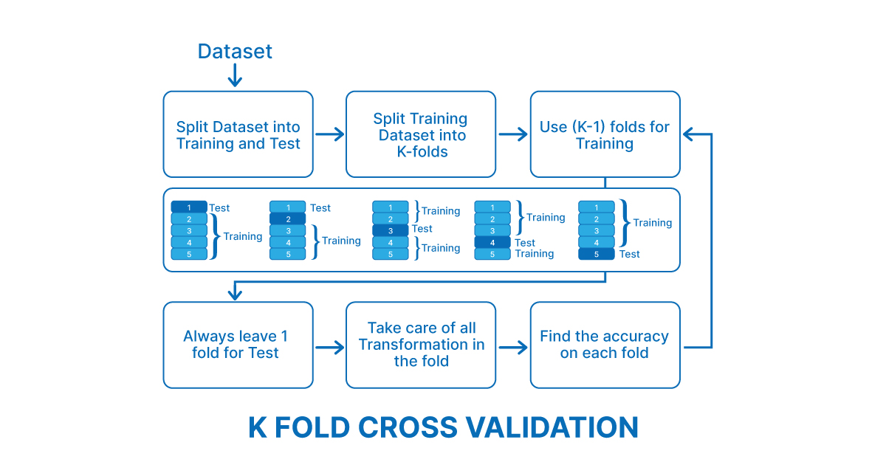
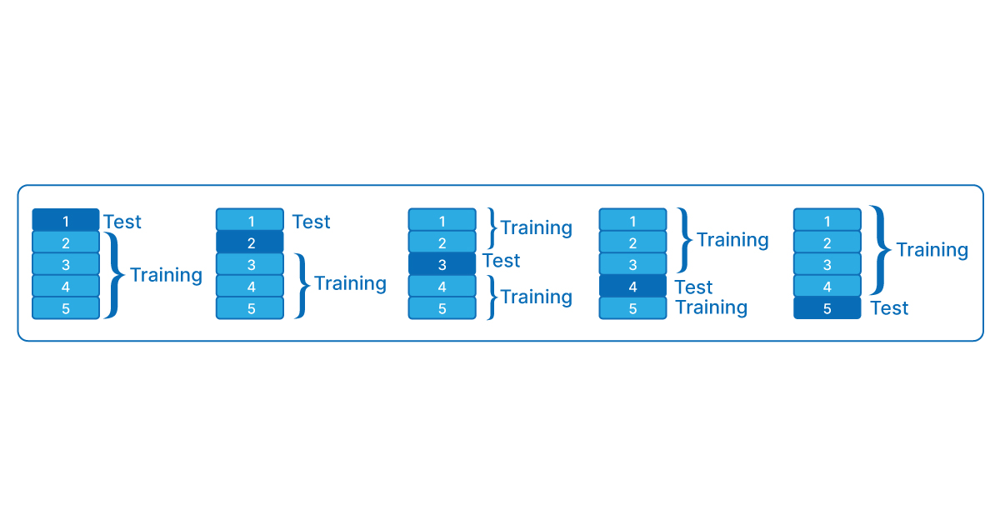
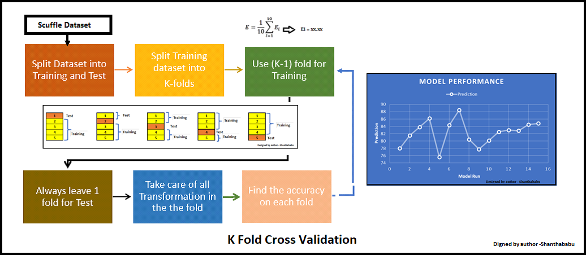
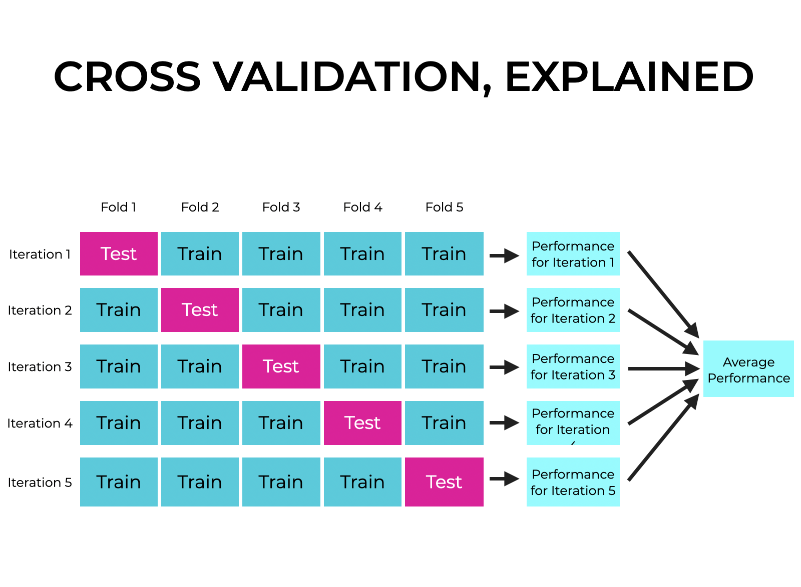
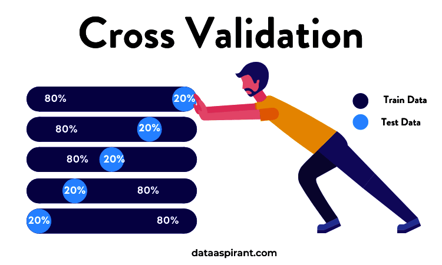
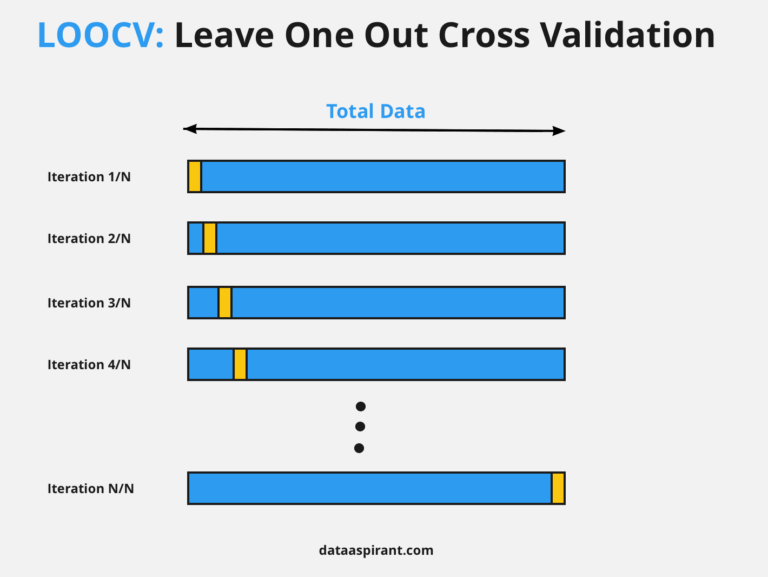
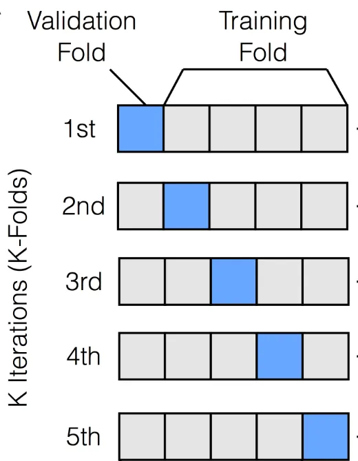

# k-fold
- To use K-Fold Cross-Validation in a neural network, you need to perform K-Fold Cross-Validation **splits** the **dataset** into **K subsets or "folds**
- K-Fold Cross-Validation Setup: Define KFold with the specified number of splits **(n_splits=k)**, shuffle=True to randomize the dataset,
- splitting our dataset into K equally-sized parts or folds., model is trained on K-1 folds, This process is repeated K times

### Steps (5 fold cross validation)
- Fold 1 (Validation): We set aside the first 20 images as our validation set. Training: We train our model on the remaining 80 images.
- Fold 2 (Validation): We set aside the next 20 images as our validation set. Training: We train our model on the remaining 80 images (excluding the validation set).
- Fold 3 (Validation): We set aside the next 20 images as our validation set. Training: We train our model on the remaining 80 images (excluding the validation set).
- Fold 4 (Validation): We set aside the next 20 images as our validation set. Training: We train our model on the remaining 80 images (excluding the validation set).
- Fold 5 (Validation): We set aside the final 20 images as our validation set. Training: We train our model on the remaining 80 images (excluding the validation set).
- 
