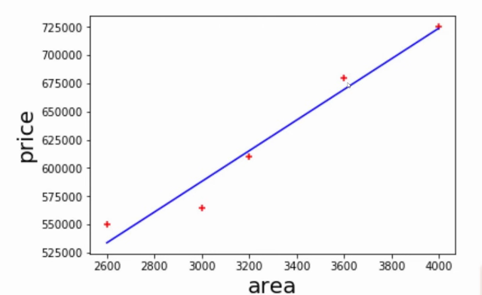
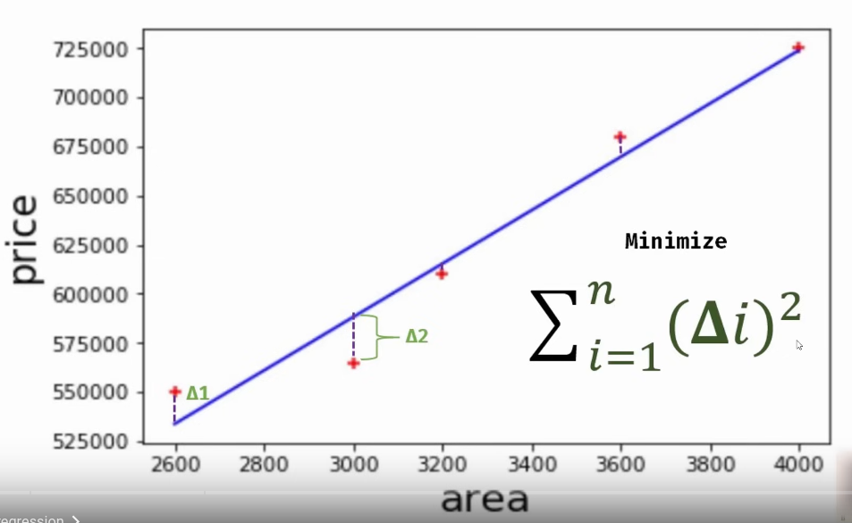
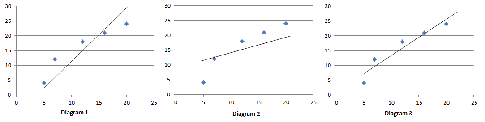
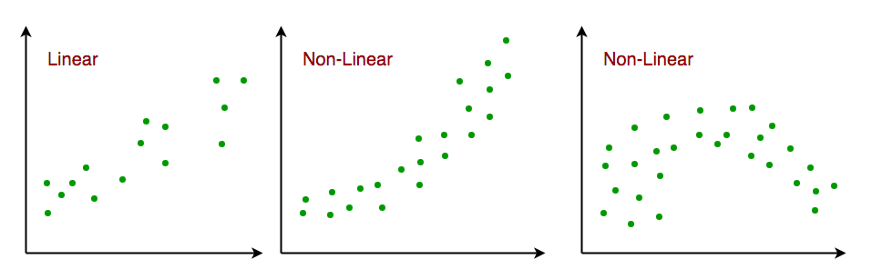

The **least squares method** is widely used for finding the **line of best fit** in linear regression. The idea is to minimize the sum of the squared differences (errors) between the observed data points and the predicted values on the line. Here's a breakdown of the process:

1. **The Goal**: The goal of the line of best fit is to find the straight line that best represents the data in a way that minimizes the vertical distance between the points and the line. These distances are also referred to as "errors" or "residuals."

2. **Why Least Squares**: Instead of just minimizing the raw distance between the data points and the line, **least squares** focuses on minimizing the square of these distances. Squaring the distances ensures that negative and positive errors don't cancel each other out, and it penalizes larger errors more than smaller ones.

3. **Visualizing It**: 
   - **Diagram 1**: A line that is too steep or too flat could have large vertical distances from many points, making it less accurate.
   - **Diagram 2**: A line that looks close but doesn't minimize the sum of the squared distances could also be suboptimal.
   - **Diagram 3**: The line that minimizes the sum of squared distances from all the points is considered the best fit.

### Why Diagram 3 is Best:
- The line in **Diagram 3** has been **calculated using the least squares method**, ensuring it has the smallest possible sum of squared differences (errors).
- This method guarantees the line is the most accurate, even if other lines might visually look close.

### Key Takeaways:
- The line of best fit is the one that minimizes the **sum of squared residuals**.
- **Diagram 3** is the best because it follows this principle, not just a subjective visual assessment of "how close" it looks.

# Resources
- https://www.youtube.com/watch?v=8jazNUpO3lQ&list=PLeo1K3hjS3uvCeTYTeyfe0-rN5r8zn9rw&index=2
- https://github.com/codebasics/py/tree/master/ML